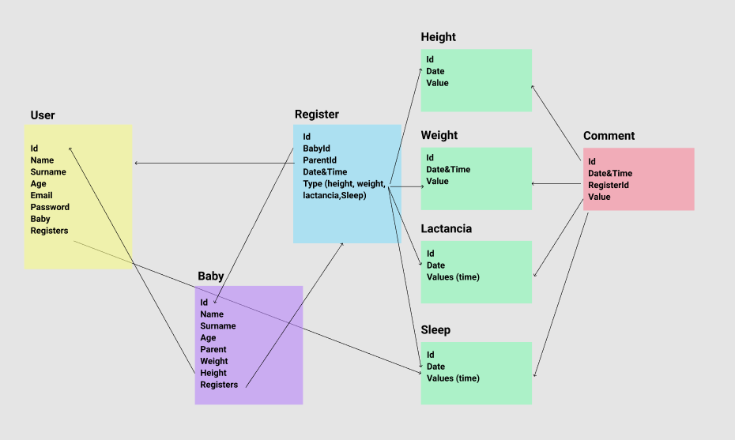

# IBaby APP
This app tracks the breastfeeding and weight of a newborn. 
The user will be able to add a baby, register each feed and weight and height variation and finally take a look at the progression of each metric trough charts.

## Data Model
