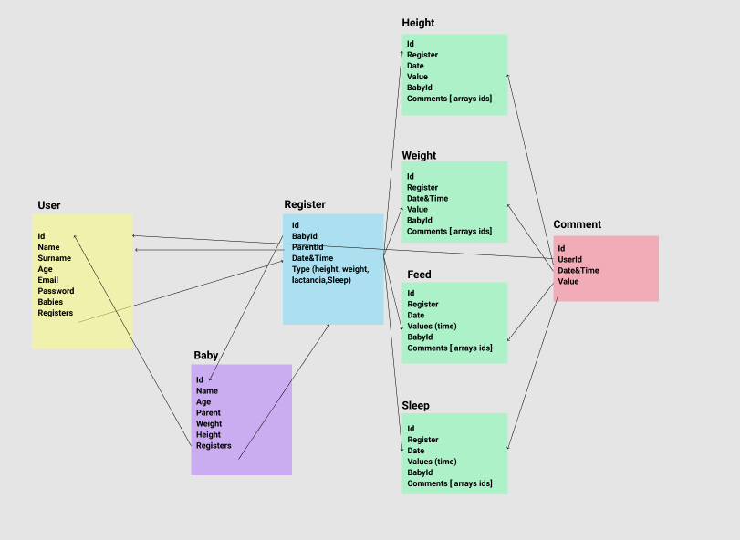

# IBaby APP
This app tracks the breastfeeding, height and weight of a newborn. 
The user will be able to add a baby, register each feed, weight,height and sleep variations and finally take a look at the progression of each metric trough charts.

## Data Model

## User cases
 - Create user - Login: The main entrance for the user. She'll have to provide its personal information to create a profile. She'll need the mail and password in order to login to the app 
 - Create baby: Once the user is created, she would be able to create a baby or babies.
 - Add registers to a baby: With the baby created the user will be able to add the registers, the core os the app.
 - Add comments to a register: A secondary feature of the app, comments offer qualitative information
 - Review metrics for the baby: Finally users will be able to check all the data added by the user.
## Backend

### Auth & JWT
The app uses an authorization middleware in order to enable user register and login.

Both in the register and login process a token is created. This token will give access to all the private routes the app has to offer.

The middleware, offers  token validation for each endpoint/functionality

Here are the list of endpoints created in order to fullfill the app requirements:

### Users

Request info:
- Email
- Password
- Age
- Name
- Surname

Public routes:
- Register: creation of the user and it's token. Fields defined on the DataModel section
- Login: User authentication endpoint. Token creation (24h duration)

Private routes:
- Get all users: Endpoint with the list of each user on the DB.
- Get user by id: Endpoint to access a concrete user by its id.
- Delete user: Endpoint to delete a user by its id.
- Update user: Endpoint to update a user by its id.
- Add baby to a user: Endpoint to add a baby to a user. 

### Baby
All private routes ⛔️

Request info:
    - Name
    - Height
    - Weight
    - Age

- Create Baby: Endpoint to create the baby
- Get all babies: Endpoint with the list of each user on the DB.
- Get baby by id: Endpoint to access a concrete baby by its id.
- Get all babies for a specific parent: Endpoint to access the baby or babies asigned to a especific user
- Delete baby: Endpoint to delete a baby by its id.
- Update baby: Endpoint to update a baby by its id.

### Registers

Request info:
- Baby
- Parent (user)
- Type of register

All private routes ⛔️ 
- Create Register: Endpoint to create a register related to a user
- Get all registers: Endpoint with the list of each register on the DB.
- Get register by id: Endpoint to access a concrete register by its id.
- Get all registers for a specific baby: Endpoint to access the list of registers asigned to a especific baby
- Delete register: Endpoint to delete a register by its id.
- Update register: Endpoint to update a register by its id.

### Height, Weight, Sleep, Feed

Request info:
    - Values for each register

All private routes ⛔️
All the register values accept the same methods, the only difference consists on the register value endpoint.

- Create Register value: Endpoint to create a register value related to a register
- Get all registers values: Endpoint with the list of each register values (height, weight, feed or sleep) on the DB.
- Get register value by id: Endpoint to access a concrete register by its id.
- Get all register values for a specific baby: Endpoint to access the list of register values asigned to a especific baby
- Delete register values: Endpoint to delete a register value by its id.
- Update register: Endpoint to update a register value by its id.

### Comments

Request info:
    - RegisterID
    - Value of the comment

All private routes ⛔️

- Create Comment: Endpoint to create a comment value related to a comment
- Get all registers : Endpoint with the list of each comment  (height, weight, feed or sleep) on the DB.
- Get comment  by id: Endpoint to access a concrete comment by its id.
- Get all comment  for a specific baby: Endpoint to access the list of comment  asigned to a especific baby
- Delete comment : Endpoint to delete a comment  by its id.
- Update comment: Endpoint to update a register  by its id.

